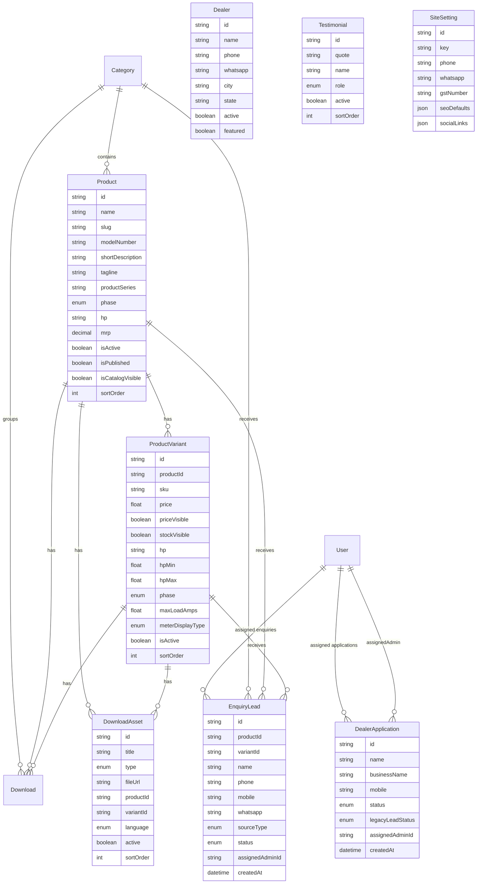

# MRK Data Model

Phase: 3

Branch: `feat/mrk-tradex-rebuild`

Migration: `20260803030000_mrk_phase_3_data_model`

Goal: extend the existing e-commerce schema into a production-ready MRK Tradex catalog, technical specification, enquiry, dealer, downloads, testimonials, contact, and site-content data model without deleting legacy commerce tables.

## 1. Design Summary

The schema keeps `Product` as the model-family record and `ProductVariant` as the SKU/specification record. Existing commerce tables remain in place for later cleanup, while the MRK public site can read catalog and lead data from the extended models.

Important reuse decisions:

- `Product`, `ProductVariant`, `Category`, `Attribute`, and `AttributeValue` remain the catalog foundation.
- `Download` is retained for existing APIs and now supports variant-specific files, version, and effective date.
- `DownloadAsset` is added as the cleaner long-term MRK file model for catalogues, price lists, manuals, brochures, and connection guides.
- `EnquiryLead` is retained instead of renaming it to `Enquiry`, preserving earlier API/code compatibility while adding MRK enquiry fields.
- `DealerApplication.status` now uses `DEALER_APPLICATION_STATUS`; `legacyLeadStatus` preserves any previous generic lead status during migration.
- `WebsiteContentBlock` remains for page/section content, and `SiteSetting` is added for global company settings such as phone, WhatsApp, GST, YouTube, SEO defaults, and social links.

## 2. ER Diagram



## 3. Product Catalog Fields

`Product` now supports model-family content:

- `shortDescription`, `tagline`, `description`: public catalog copy at different lengths.
- `productLine` remains for existing code; `productSeries` adds a normalized MRK-facing series field.
- `phase`, `hp`, `modelNumber`, `mrp`, `warranty`, and starter/panel fields remain available for product-level defaults.
- `protectionFeatures` and `useCases` are string arrays because these are flexible marketing/technical bullets, not primary filters yet.
- `seoTitle`, `seoDescription`, `featuredVideoUrl`, `manualUrl`, and `videoUrl` support public technical pages.
- `isActive`, `isPublished`, `isCatalogVisible`, and `sortOrder` separate internal lifecycle, public publish state, legacy visibility, and display order.

`ProductVariant` now supports SKU/specification detail:

- `sku` remains the model code and unique SKU identifier.
- `price` remains the MRP-compatible numeric field; `priceVisible` controls whether public pages show it.
- `stock` remains for admin/back-office compatibility; `stockVisible` keeps inventory counts hidden on the MRK public site by default.
- `hp`, `hpMin`, `hpMax`, `phase`, and `meterDisplayType` are normalized for filtering.
- `maxLoadAmps`, `boxType`, `bodyType`, `meterType`, `meterSize`, `startCapacitor`, `runCapacitor`, `mcbRelayOlp`, and `warranty` hold technical specifications.
- `protectionFeatures` and `installationInfo` hold flexible technical details that are not expected to be relational filters immediately.
- `images`, `manualUrl`, `videoUrl`, `isActive`, and `sortOrder` support public display and admin ordering.

Public catalog behavior:

- GraphQL product listing/detail queries only expose products where `isActive`, `isPublished`, and `isCatalogVisible` are true.
- Public product queries require at least one active variant and only return active variants ordered by `sortOrder`.
- Catalog filters now use normalized `phase` and `meterDisplayType` fields, with price range filtering limited to active variants whose MRP is public.
- Public cards respect `priceVisible` and `stockVisible`, so MRK can hide MRP or inventory state while still accepting enquiries.

## 4. Leads and Dealer Flow

`EnquiryLead` is the production enquiry model for now:

- Product/category/variant relations are nullable and use `SetNull` deletion behavior so historical enquiries survive product cleanup.
- Contact fields include `phone`, `mobile`, `whatsapp`, `email`, `city`, `state`, and `pincode`.
- `sourceType` uses `ENQUIRY_SOURCE` for reporting; the older `source` string remains for compatibility and raw source labels.
- `assignedAdminId` is optional and uses `SetNull` so lead records survive admin deletion.
- UTM and `referrer` fields support attribution without storing secrets.

`Dealer` stores approved/public dealer records with location, contact, service areas, and display flags.

`DealerApplication` stores inbound applications:

- `status` uses `DEALER_APPLICATION_STATUS`: `NEW`, `REVIEWING`, `APPROVED`, `REJECTED`, `ON_HOLD`.
- `legacyLeadStatus` preserves the old generic lead status during migration.
- `currentBusiness`, `productCategories`, `experience`, `internalNotes`, and optional admin assignment support review workflow.

## 5. Downloads, Testimonials, and Site Settings

`Download` remains compatible with the existing Phase 1/2 API and gains `variantId`, `version`, and `effectiveDate`.

`DownloadAsset` is the preferred MRK model for future admin/download screens:

- Types: `CATALOG`, `PRICE_LIST`, `MANUAL`, `BROCHURE`, `CONNECTION_GUIDE`, plus retained `VIDEO` and `OTHER`.
- Product and variant relations are nullable with `SetNull`.
- `language`, `active`, `sortOrder`, `version`, and `effectiveDate` support public filtering and freshness.

`Testimonial` is independent from old commerce `Review`. It supports curated MRK quotes by dealers, farmers, homeowners, or other users and can be safely hidden until real content is supplied.

`SiteSetting` stores global public business details. Use a singleton row with `key = "global"` unless the project later needs region-specific settings.

## 6. Indexes and Integrity

Added indexes cover:

- Product/category visibility and ordering: `categoryId`, `isActive`, `isPublished`, `sortOrder`.
- Technical filtering: `productSeries`, `phase`, `hpMin`, `hpMax`.
- Lead workflows: `status`, `sourceType`, `createdAt`, `assignedAdminId`, `city`, `state`.
- Dealer lookup: `active`, `featured`, `city`, `state`, `pincode`.
- Download filtering: `type`, `language`, `active`, `sortOrder`, product/variant relations.

Deletion behavior:

- Product/category/variant relations on leads and downloads use `SetNull`.
- Admin assignment uses `SetNull`.
- Existing commerce-owned relations remain unchanged in this phase.

## 7. Validation and Privacy Notes

Application-layer validation now enforces these checks in the MRK service for
public and admin write paths:

- Required mobile/phone format for leads, dealers, and dealer applications.
- Email format when provided.
- Pincode format for India where applicable.
- HTTP/HTTPS URL validation for download file URLs, thumbnails, and YouTube.
- GST format validation when a GST number is provided.
- Site-setting key validation for safe singleton/region keys.
- Product admin create/update now accepts the MRK product lifecycle flags, technical copy/spec fields, SEO fields, product videos/manual URLs, and variant-level visibility/specification fields through the existing multipart product API.

Validation still to add in a later upload-focused phase:

- Allowed file types and size checks before Cloudinary/upload persistence.
- Strict URL validation for product-level `manualUrl`, `videoUrl`, and `featuredVideoUrl` before persistence.

Privacy:

- Do not store secrets in `SiteSetting`, `metadata`, `seoDefaults`, or `socialLinks`.
- Lead notes are internal admin data and should require admin authorization.
- Public APIs should not expose `internalNotes`, UTM details where unnecessary, or admin assignment fields.

## 8. Implemented Backend Surface

The Phase 3 support models are now exposed through the MRK backend module:

| Route                                         | Purpose                                                            |
| --------------------------------------------- | ------------------------------------------------------------------ |
| `GET /api/v1/mrk/dealers`                     | Public active dealer list with optional `city` and `state` filters |
| `GET /api/v1/mrk/download-assets`             | Public active download assets                                      |
| `GET /api/v1/mrk/testimonials`                | Public active testimonials                                         |
| `GET /api/v1/mrk/site-settings`               | Public global/site setting lookup                                  |
| `GET /api/v1/mrk/admin/dealers`               | Admin dealer list                                                  |
| `POST /api/v1/mrk/admin/dealers`              | Admin dealer create                                                |
| `PATCH /api/v1/mrk/admin/dealers/:id`         | Admin dealer update                                                |
| `GET /api/v1/mrk/admin/download-assets`       | Admin download asset list                                          |
| `POST /api/v1/mrk/admin/download-assets`      | Admin download asset create                                        |
| `PATCH /api/v1/mrk/admin/download-assets/:id` | Admin download asset update                                        |
| `GET /api/v1/mrk/admin/testimonials`          | Admin testimonial list                                             |
| `POST /api/v1/mrk/admin/testimonials`         | Admin testimonial create                                           |
| `PATCH /api/v1/mrk/admin/testimonials/:id`    | Admin testimonial update                                           |
| `PUT /api/v1/mrk/admin/site-settings`         | Admin upsert for global/site settings                              |

## 9. Migration Risks and Tradeoffs

- Existing commerce models were preserved, so the schema is larger than the final MRK site may need.
- `EnquiryLead` was extended instead of creating a separate `Enquiry` table to preserve existing code and avoid data movement.
- `DownloadAsset` was added alongside existing `Download`; later phases can consolidate once admin/download requirements are stable.
- Dealer application status is now dealer-specific. The migration maps previous generic statuses and stores the original in `legacyLeadStatus`.
- Product-level and variant-level technical fields overlap intentionally. Product-level values act as defaults/model-family content; variant-level values represent exact SKU specifications.
- `price` remains on `ProductVariant` as the MRP field to avoid duplicating price data; public display is controlled by `priceVisible`.
- Flexible arrays/JSON are used only for details unlikely to be primary filters in Phase 3.

## 10. Verification Status

Commands run after the Phase 3 schema update:

```bash
npx.cmd prisma validate --schema prisma/schema.prisma
npx.cmd prisma generate --schema prisma/schema.prisma
npx.cmd prisma migrate deploy --schema prisma/schema.prisma
npx.cmd prisma migrate status --schema prisma/schema.prisma
npm.cmd run seed
npm.cmd run build
npx.cmd tsc --noEmit seeds/seed.ts --esModuleInterop --skipLibCheck --module commonjs --target es2020
```

Results:

- Prisma schema validation passed with a temporary schema-check Postgres URL.
- Prisma Client generation passed.
- All 83 repository migrations applied successfully to an isolated temporary local PostgreSQL database on port `55432`.
- Prisma migration status reported the temporary verification database schema is up to date.
- Existing seed data ran successfully against the temporary verification database.
- Backend TypeScript build passed.
- Seed TypeScript checking passed without executing the seed.
- Applying the migration to the project's normal local database is still pending because `src/server/.env` does not contain a real `postgresql://` or `postgres://` `DATABASE_URL`.

Environment note:

- `src/server/.env.example` and the local `src/server/.env` now keep `DATABASE_URL` blank with an example comment above it. This prevents Prisma from interpreting an inline placeholder comment as a malformed connection URL.
- Temporary database verification did not modify the normal PostgreSQL service or any project database configured by `src/server/.env`.
