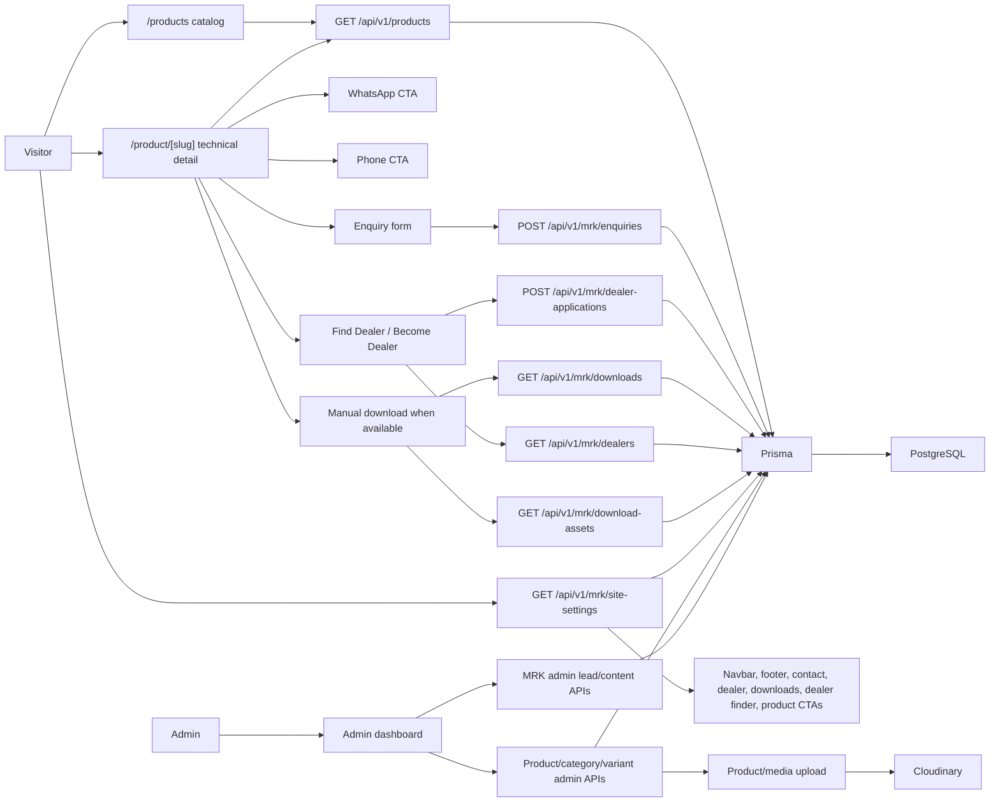
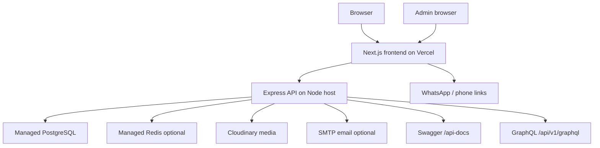

# MRK Target Architecture

Phase: 2

Branch: `feat/mrk-tradex-rebuild`

Goal: convert the public customer experience from checkout-focused e-commerce into the official MRK Tradex Pvt Ltd product-catalog, technical-information, enquiry, and dealer-generation website.

This phase establishes direction and safety switches. It does not delete legacy commerce modules.

## 1. Feature Configuration

Feature flags are centralized in:

- Frontend: `src/client/app/lib/config/features.ts`
- Backend: `src/server/src/config/features.ts`

Default flags:

| Feature                | Default | Meaning                                                                          |
| ---------------------- | ------- | -------------------------------------------------------------------------------- |
| `commerceEnabled`      | `false` | Cart, checkout, payments, shipments, and customer order flows are hidden/blocked |
| `customerAuthEnabled`  | `false` | Public customer sign-in prompts are hidden                                       |
| `reviewsEnabled`       | `false` | Public ratings/reviews are hidden/blocked until MRK supplies real content        |
| `liveChatEnabled`      | `false` | Customer support chat is hidden/blocked                                          |
| `enquiryEnabled`       | `true`  | Product/contact enquiry flow is active                                           |
| `dealerLocatorEnabled` | `true`  | Dealer/dealership flow is active                                                 |
| `downloadsEnabled`     | `true`  | Catalogue/manual/price-list download flow is active                              |
| `hindiEnabled`         | `false` | Hindi UI/content is deferred                                                     |

Frontend overrides use `NEXT_PUBLIC_FEATURE_*` variables. Backend overrides use `FEATURE_*` variables.

## 2. Retained Modules

These stay as core MRK foundations.

| Module                               | Reason                                                                 |
| ------------------------------------ | ---------------------------------------------------------------------- |
| Authentication for admins            | Needed for admin dashboard and content/catalog management              |
| Roles and permissions                | Needed for admin/superadmin separation                                 |
| `Product`                            | Main MRK catalog entity                                                |
| `ProductVariant`                     | Useful for model/SKU/stock/spec variants                               |
| `Category`                           | Needed for product discovery by category                               |
| `Attribute` and `AttributeValue`     | Useful for technical dimensions such as phase, HP, panel type, voltage |
| Cloudinary/upload foundation         | Needed for product photos, catalog images, manuals, and media          |
| Admin dashboard foundation           | Can be adapted for product/content/lead management                     |
| Logs/audit functionality             | Useful for backend visibility and admin actions                        |
| Analytics foundation                 | Useful for product views, enquiries, downloads, lead sources           |
| PostgreSQL and Prisma                | Primary persistent data layer                                          |
| Redis                                | Keep where it clearly supports sessions, cache, or rate-limiting       |
| Swagger                              | Keep for API inspection                                                |
| GraphQL product/analytics foundation | Keep while product discovery uses existing hooks                       |

## 3. Adapted Modules

| Existing Module                    | MRK Direction                                                                                                                       |
| ---------------------------------- | ----------------------------------------------------------------------------------------------------------------------------------- |
| Product listing                    | Becomes product catalog/product discovery with public visibility, active-variant, phase, meter-display, category, and price filters |
| Product detail                     | Becomes technical specification and enquiry page                                                                                    |
| Product variants                   | Represent SKUs, model differences, stock, technical combinations                                                                    |
| Categories                         | MRK product families: single-phase starters, three-phase panels, WLC smart plugs, cables/accessories                                |
| Sections/content blocks            | Reuse for homepage/technical content later                                                                                          |
| Reports/analytics                  | Adapt to leads, catalogue downloads, product interest, dealer applications                                                          |
| Admin products/categories/variants | Product create/edit now captures MRK technical fields; categories/attributes remain useful for filtering/spec dimensions            |
| Contact/chat concepts              | Prefer form/phone/WhatsApp first; chat stays disabled unless intentionally retained                                                 |
| Downloads                          | Becomes catalogues, price lists, manuals, videos                                                                                    |

## 4. Hidden Modules

Hidden/blocked from the public MRK experience by default:

| Module/Flow              | Public Status                                                |
| ------------------------ | ------------------------------------------------------------ |
| Add to cart              | Hidden                                                       |
| Cart page                | Redirects to `/products`                                     |
| Checkout page/API        | Hidden/blocked                                               |
| Stripe payment           | Hidden/blocked                                               |
| Order history            | Redirects to `/products`                                     |
| Shipment tracking        | Hidden/redirected through order routes                       |
| Customer account prompts | Hidden from public navigation                                |
| Ratings/reviews          | Hidden/blocked                                               |
| Customer support chat    | Redirects to `/contact`; backend chat blocked unless enabled |

## 5. Final Cleanup Candidates

Only remove these after MRK catalog/enquiry launch is stable:

- Stripe checkout service and webhook.
- Cart, cart item, and cart event modules.
- Customer order pages and APIs.
- Payments, shipments, and transactions if not needed for admin records.
- Reviews if MRK uses testimonials instead.
- Socket.IO chat/WebRTC if MRK does not intentionally retain live support.
- Social OAuth if admins use email/password only.
- Generic e-commerce seed data and screenshots.
- Old Docker files if the final deployment is Vercel + Node host rather than Docker.

## 6. Proposed Frontend Route Map

| Route                   | Purpose                                                                                                 | Phase 2 Status                                                            |
| ----------------------- | ------------------------------------------------------------------------------------------------------- | ------------------------------------------------------------------------- |
| `/`                     | MRK homepage with catalog, enquiry, dealer, and downloads entry points                                  | Active MRK-aligned first viewport                                         |
| `/products`             | Main product catalog                                                                                    | Active alias to current catalog implementation with MRK technical filters |
| `/shop`                 | Legacy catalog route                                                                                    | Kept for compatibility with MRK catalog filters                           |
| `/product/[slug]`       | Technical product detail, variant-aware enquiry, manual download, WhatsApp/call, and dealer finder CTAs | Active                                                                    |
| `/contact`              | Contact/enquiry form, phone, WhatsApp                                                                   | Active                                                                    |
| `/dealer`               | Dealership application                                                                                  | Active                                                                    |
| `/downloads`            | Catalogues, price lists, manuals, brochures, and connection guides                                      | Active                                                                    |
| `/about`                | Company/Why MRK                                                                                         | Proposed                                                                  |
| `/find-dealer`          | Active dealer finder with city/state filters and contact CTAs                                           | Active                                                                    |
| `/sign-in`              | Admin sign-in                                                                                           | Retained by URL, hidden from public prompts                               |
| `/dashboard`            | Admin dashboard                                                                                         | Retained                                                                  |
| `/dashboard/products`   | Product catalog admin with MRK technical product/variant fields                                         | Active                                                                    |
| `/dashboard/categories` | Category admin                                                                                          | Retained/adapt later                                                      |
| `/dashboard/attributes` | Attribute/spec admin                                                                                    | Retained/adapt later                                                      |
| `/dashboard/inventory`  | Stock/variant admin                                                                                     | Retained/adapt later                                                      |
| `/dashboard/analytics`  | Analytics                                                                                               | Retained/adapt later                                                      |
| `/dashboard/logs`       | Logs/audit                                                                                              | Retained                                                                  |
| `/dashboard/users`      | Admin/user management                                                                                   | Retained                                                                  |
| `/dashboard/mrk`        | MRK enquiries, dealer applications, dealers, downloads, testimonials, and site settings                 | Active                                                                    |
| `/dashboard/enquiries`  | Product/contact enquiries                                                                               | Replaced by `/dashboard/mrk`                                              |
| `/dashboard/dealers`    | Dealer applications                                                                                     | Replaced by `/dashboard/mrk`                                              |
| `/dashboard/downloads`  | Downloads/manuals admin                                                                                 | Replaced by `/dashboard/mrk`                                              |
| `/cart`                 | Legacy commerce route                                                                                   | Redirects to `/products`                                                  |
| `/checkout`             | Legacy commerce route                                                                                   | Redirects to `/products`                                                  |
| `/orders`               | Legacy customer order route                                                                             | Redirects to `/products`                                                  |
| `/orders/[orderId]`     | Legacy tracking route                                                                                   | Redirects to `/products`                                                  |
| `/support`              | Legacy chat support                                                                                     | Redirects to `/contact` unless live chat is enabled                       |

Homepage implementation note:

- The first viewport now uses a project-local generated bitmap asset,
  `src/client/app/assets/images/mrk-control-panel-hero.png`, instead of the
  old laptop/furniture/shirt/shoe e-commerce slider images.
- Homepage category copy now uses MRK catalog/product-family language and links
  to `/products`.
- The public homepage visual direction is now aligned to the supplied Noise
  reference screenshots: black top navigation, wide rounded hero banner, clean
  white background, horizontal category/product carousels, bold black headings,
  soft product cards, and minimal accent color. Commerce actions remain hidden;
  public CTAs stay focused on catalog details, enquiries, WhatsApp, phone,
  dealers, and downloads.
- Demo mode now uses browser-local demo state for MRK enquiries, contact
  submissions, dealer applications, dealer records, download assets,
  testimonials, and site settings. This keeps public form submissions and the
  `/dashboard/mrk` review screens connected even when no backend API is running.

## 7. Proposed Backend Route Map

Public/catalog:

| Route                             | Purpose                  | Status                                |
| --------------------------------- | ------------------------ | ------------------------------------- |
| `GET /api/v1/products`            | Product listing          | Retained for REST/admin compatibility |
| `GET /api/v1/products/:id`        | Product by ID            | Retained                              |
| `GET /api/v1/products/slug/:slug` | Product by slug          | Retained                              |
| `GET /api/v1/categories`          | Category listing         | Retained                              |
| `GET /api/v1/categories/:id`      | Category details         | Retained                              |
| `GET /api/v1/attributes`          | Technical attribute data | Retained as useful                    |
| `GET /api/v1/variants`            | Variant/SKU data         | Retained as useful                    |

GraphQL public catalog:

| Query                                                                       | Purpose           | Public Rules                                                                                                                     |
| --------------------------------------------------------------------------- | ----------------- | -------------------------------------------------------------------------------------------------------------------------------- |
| `products(first, skip, filters)`                                            | Product discovery | Active, published, catalog-visible products only; at least one active variant; category, price, phase, and meter-display filters |
| `product(slug)`                                                             | Product detail    | Active, published, catalog-visible products only; active variants only                                                           |
| `newProducts`, `featuredProducts`, `trendingProducts`, `bestSellerProducts` | Product groups    | Same public visibility and active-variant rules                                                                                  |
| `categories`                                                                | Category filters  | Visible categories only, with at least one public active product                                                                 |

MRK lead/download:

| Route                                  | Purpose                                                                       | Feature                |
| -------------------------------------- | ----------------------------------------------------------------------------- | ---------------------- |
| `POST /api/v1/mrk/enquiries`           | Product/general enquiry lead                                                  | `enquiryEnabled`       |
| `POST /api/v1/mrk/contact-submissions` | Contact/feedback form                                                         | `enquiryEnabled`       |
| `POST /api/v1/mrk/dealer-applications` | Dealer application                                                            | `dealerLocatorEnabled` |
| `GET /api/v1/mrk/downloads`            | Public downloads                                                              | `downloadsEnabled`     |
| `GET /api/v1/mrk/download-assets`      | Public MRK catalogues, price lists, manuals, brochures, and connection guides | `downloadsEnabled`     |
| `GET /api/v1/mrk/dealers`              | Public active dealer listing with optional `city` and `state` filters         | `dealerLocatorEnabled` |
| `GET /api/v1/mrk/testimonials`         | Public active testimonials                                                    | Always available       |
| `GET /api/v1/mrk/site-settings`        | Public global phone, WhatsApp, email, GST, YouTube, SEO, and social settings  | Always available       |

Hidden/blocked by default:

| Route                     | Feature           |
| ------------------------- | ----------------- |
| `/api/v1/cart/*`          | `commerceEnabled` |
| `/api/v1/checkout/*`      | `commerceEnabled` |
| `/api/v1/payments/*`      | `commerceEnabled` |
| `/api/v1/shipment/*`      | `commerceEnabled` |
| `/api/v1/orders/user`     | `commerceEnabled` |
| `/api/v1/orders/:orderId` | `commerceEnabled` |
| `/api/v1/reviews/*`       | `reviewsEnabled`  |
| `/api/v1/chat/*`          | `liveChatEnabled` |

## 8. Proposed Admin Route Map

| Route                                                    | Purpose                                              | Status         |
| -------------------------------------------------------- | ---------------------------------------------------- | -------------- |
| `POST /api/v1/auth/sign-in`                              | Admin login                                          | Retained       |
| `GET /api/v1/users/me`                                   | Current admin profile                                | Retained       |
| `GET /api/v1/users`                                      | User/admin listing                                   | Retained       |
| `POST /api/v1/users/admin`                               | Superadmin creates admin                             | Retained       |
| `POST /api/v1/products`                                  | Product create with MRK catalog/specification fields | Active         |
| `PUT /api/v1/products/:id`                               | Product update with MRK catalog/specification fields | Active         |
| `DELETE /api/v1/products/:id`                            | Product delete                                       | Retained       |
| `POST /api/v1/categories`                                | Category create                                      | Retained/adapt |
| `DELETE /api/v1/categories/:id`                          | Category delete                                      | Retained       |
| `POST /api/v1/variants`                                  | Variant create                                       | Retained/adapt |
| `PATCH /api/v1/variants/:id`                             | Variant update                                       | Retained/adapt |
| `POST /api/v1/variants/:id/restock`                      | Inventory restock                                    | Retained       |
| `GET /api/v1/logs`                                       | Logs/audit                                           | Retained       |
| `GET /api/v1/analytics/*`                                | Analytics/reporting                                  | Retained/adapt |
| `GET /api/v1/mrk/admin/enquiries`                        | Enquiry management                                   | Active         |
| `PATCH /api/v1/mrk/admin/enquiries/:id/status`           | Enquiry status update                                | Active         |
| `GET /api/v1/mrk/admin/dealer-applications`              | Dealer application management                        | Active         |
| `PATCH /api/v1/mrk/admin/dealer-applications/:id/status` | Dealer status update                                 | Active         |
| `GET /api/v1/mrk/admin/contact-submissions`              | Contact submission management                        | Active         |
| `PATCH /api/v1/mrk/admin/contact-submissions/:id/status` | Contact status update                                | Active         |
| `GET /api/v1/mrk/admin/downloads`                        | Download listing                                     | Active         |
| `POST /api/v1/mrk/admin/downloads`                       | Download create                                      | Active         |
| `GET /api/v1/mrk/admin/download-assets`                  | Download asset listing                               | Active         |
| `POST /api/v1/mrk/admin/download-assets`                 | Download asset create                                | Active         |
| `PATCH /api/v1/mrk/admin/download-assets/:id`            | Download asset update                                | Active         |
| `GET /api/v1/mrk/admin/dealers`                          | Dealer listing                                       | Active         |
| `POST /api/v1/mrk/admin/dealers`                         | Dealer create                                        | Active         |
| `PATCH /api/v1/mrk/admin/dealers/:id`                    | Dealer update                                        | Active         |
| `GET /api/v1/mrk/admin/testimonials`                     | Testimonial listing                                  | Active         |
| `POST /api/v1/mrk/admin/testimonials`                    | Testimonial create                                   | Active         |
| `PATCH /api/v1/mrk/admin/testimonials/:id`               | Testimonial update                                   | Active         |
| `PUT /api/v1/mrk/admin/site-settings`                    | Upsert global/site setting row                       | Active         |

## 9. Data Flow

## 10. Deployment Diagram

## 11. Phase 2 Decisions

- Keep old modules in source.
- Hide/guard old public commerce routes with feature flags.
- Prefer `/products` as the public catalog URL.
- Keep `/shop` for compatibility until final route cleanup.
- Keep admin dashboard routes stable.
- Do not change Prisma schema in this phase.
- Homepage redesign is limited to the agreed MRK catalog/enquiry visual shell;
  old cart, checkout, payment, and order modules remain guarded for later cleanup.
